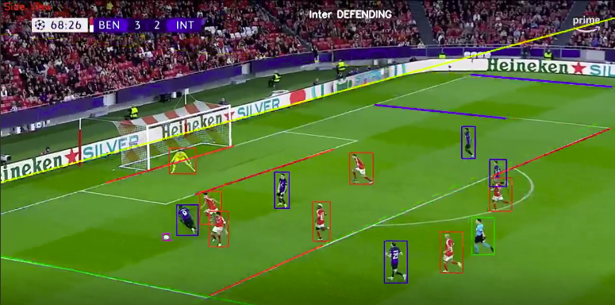

# SOCCER VISION

## Soccer Visual Inference Using Object Detection

**Authors**: Abba Davide, Aloscari Sebastiano, Catalini Riccardo

The Soccer Vision project applies event captioning methods to soccer matches, aiming to understand and analyze match situations by videos. Leveraging advanced deep learning techniques and geometry considerations the project provides valuable insights for coaches, analysts, and soccer academies.

### Objectives
- Analyze soccer match situations and events using computer vision.
- Provide coaches with insights into team tactics and strategies.
- Enhance player training based on opponent teams analysis.
- Facilitate match analysis and decision-making processes.

### Key Features
- Automated event captioning using YOLOv5.
- Detection of players, referee, ball, and key events (corner, penalties, etc.).
- Recognition of the shot type.

### Conclusion
Considering the restricted resouces we had the Soccer Vision project offers a powerful tool for soccer analysis and coaching, empowering teams to make data-driven decisions and improve performance on the field. With its good capabilities, it opens up new possibilities for understanding and interpreting soccer matches.
